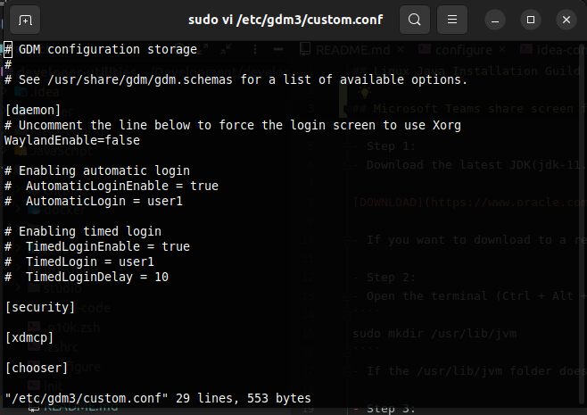

## Microsoft Teams share screen fix

```shell
sudo vi /etc/gdm3/custom.conf
```

By running the command above, uncomment `WaylandEnable=false`. Save the changes and reboot the system<br><br>



## Linux Java Installation Guild

- Step 1:
- Download the latest JDK(jdk-11.0.12_linux-x64_bin.tar.gz) from the official site.

[DOWNLOAD](https://www.oracle.com/java/technologies/javase-jdk11-downloads.html)

- If you want to download to a remote server or if you simply prefer wget, use the command given in this StackOverflow answer: Downloading JDK

- Step 2:
- Open the terminal (Ctrl + Alt + T) and enter the following command.

````
sudo mkdir /usr/lib/jvm
````

- If the /usr/lib/jvm folder does not exist, this command will create the directory. If you already have this folder, you can ignore this - Step and move to the
  next - Step.

- Step 3:
- Enter the following command to change the directory.

````
cd /usr/lib/jvm
````

- Step 4:
- Extract the jdk-Xuxx-linux-xXX.tar.gz file in that directory using this command.

````
sudo tar -xvzf ~/Downloads/jdk-11.0.12_linux-x64_bin.tar.gz
````

- According to this command, the JDK filename is jdk-11.0.12_linux-x64_bin.tar.gz and which is located in the ~/Downloads folder. If your downloaded file is in
  any other location, change the command according to your path.

- Enter the following command to open the environment variables file.
- Step 5:

````
sudo nano /etc/environment
````

- According to your personal preference, you can choose any text editors instead of nano.

- In the opened file, add the following bin folder to the existing PATH variable.

- Step 6:

````
/usr/lib/jvm/jdk-11.0.12/bin
````

- The PATH variables must be separated by colon.

- Add the following environment variables at the end of the file.

````
JAVA_HOME="/usr/lib/jvm/jdk-11.0.12"
````

- The environment file before the modification:

````
PATH="/usr/local/sbin:/usr/local/bin:/usr/sbin:/usr/bin:/sbin:/bin:/usr/games:/usr/local/games"
````

- The environment file after the modification:

````
PATH="/usr/local/sbin:/usr/local/bin:/usr/sbin:/usr/bin:/sbin:/bin:/usr/games:/usr/local/games:/usr/lib/jvm/jdk-11.0.12/bin"
````

````
JAVA_HOME="/usr/lib/jvm/jdk-11.0.12"
````

- Save the changes and close nano (Ctrl + O, Ctrl + X).

- Step 7:
- Enter the following commands to inform the system about the Java's location. Depending on your JDK version, the paths can be different.

````
sudo update-alternatives --install /usr/bin/java  java /usr/lib/jvm/jdk-11.0.12/bin/java 0
````

````
sudo update-alternatives --install /usr/bin/javac javac /usr/lib/jvm/jdk-11.0.12/bin/javac 0
````

````
sudo update-alternatives --set java /usr/lib/jvm/jdk-11.0.12/bin/java
````

````
sudo update-alternatives --set javac /usr/lib/jvm/jdk-11.0.12/bin/javac
````

- Step 8:
- To verify the setup enter the following commands and make sure that they print the location of java and javac as you have provided in the previous - Step.

````
update-alternatives --list java
````

```` 
update-alternatives --list javac
````

- Step 9:
  Restart the computer (or just log-out and login) and open the terminal again.
- Enter the following command.
- Step 10:

````
java -version
````

If you get the installed Java version as the output, you have successfully installed the Oracle JDK in your system.
